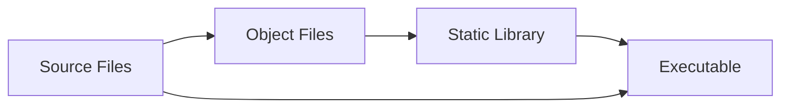

# 📚 Object Files and Static Libraries Guide (.o & .a)

> **A comprehensive guide to understanding and working with object files and static libraries in C/C++ development**

---

## 🎯 Table of Contents

- [Overview](#overview)
- [Object Files (.o)](#object-files-o)
- [Static Libraries (.a)](#static-libraries-a)
- [Workflow & Usage](#workflow--usage)
- [Practical Example](#practical-example)
- [Best Practices](#best-practices)
- [Common Commands](#common-commands)

---

## 📖 Overview

This guide provides a comprehensive overview of **object files (.o)** and **static libraries (.a)** - essential components in C/C++ development that enable modular, efficient, and reusable code organization.

### 🎯 What You'll Learn

- Understanding the compilation process
- Working with object files and static libraries
- Building modular and maintainable projects
- Optimizing build times and code reuse

---

## 🔧 Object Files (.o)

**Object files** are intermediate compilation outputs that contain machine code but are not yet executable programs.

### ✨ Key Characteristics

| Feature | Description |
|---------|-------------|
| **Non-executable** | Cannot run independently - requires linking |
| **Symbol Table** | Contains function/variable definitions and external references |
| **Modular** | Enables incremental compilation for faster builds |
| **Platform-specific** | Contains machine code for target architecture |

### 🔍 What's Inside?

```
┌─────────────────┐
│   Object File   │
├─────────────────┤
│ Machine Code    │
│ Symbol Table    │
│ Relocation Info │
│ Debug Info      │
└─────────────────┘
```

---

## 📦 Static Libraries (.a)

**Static libraries** are archives containing one or more object files, created using the `ar` utility.

### ✨ Key Characteristics

| Feature | Description |
|---------|-------------|
| **Archive Format** | Collection of object files (like a ZIP for .o files) |
| **Static Linking** | Code is embedded directly into final executable |
| **No Dependencies** | Final program has no external library requirements |
| **Larger Size** | Increases executable size due to code duplication |

### 🔍 Library Structure

```
┌─────────────────┐
│ Static Library  │
├─────────────────┤
│ Object File 1   │
│ Object File 2   │
│ Object File 3   │
│ Symbol Index    │
└─────────────────┘
```

---

## ⚙️ Workflow & Usage

### 🔄 Development Process



### 📋 Step-by-Step Workflow

1. **Compilation** → Source files to object files
2. **Archiving** → Object files to static library
3. **Linking** → Library + main program to executable

---

## 💻 Practical Example

Let's build a simple math library to demonstrate the complete workflow.

### 📁 Project Structure

```
math_project/
├── math_functions.h
├── math_functions.c
├── main.c
└── Makefile
```

### 🔧 Header File

```c
// math_functions.h
#ifndef MATH_FUNCTIONS_H
#define MATH_FUNCTIONS_H

// Function declarations
int add(int a, int b);
int subtract(int a, int b);
int multiply(int a, int b);
double divide(double a, double b);

#endif
```

### 🔧 Implementation

```c
// math_functions.c
#include "math_functions.h"

int add(int a, int b) {
    return a + b;
}

int subtract(int a, int b) {
    return a - b;
}

int multiply(int a, int b) {
    return a * b;
}

double divide(double a, double b) {
    if (b != 0) {
        return a / b;
    }
    return 0.0; // Error case
}
```

### 🔧 Main Program

```c
// main.c
#include <stdio.h>
#include "math_functions.h"

int main() {
    int a = 10, b = 5;
    
    printf("🔢 Math Operations Demo\n");
    printf("======================\n");
    printf("a = %d, b = %d\n\n", a, b);
    
    printf("➕ Addition: %d + %d = %d\n", a, b, add(a, b));
    printf("➖ Subtraction: %d - %d = %d\n", a, b, subtract(a, b));
    printf("✖️  Multiplication: %d * %d = %d\n", a, b, multiply(a, b));
    printf("➗ Division: %.1f / %.1f = %.2f\n", (double)a, (double)b, divide(a, b));
    
    return 0;
}
```

### 🛠️ Build Process

#### Step 1: Compile to Object Files

```bash
# Compile source files to object files
gcc -c math_functions.c -o math_functions.o
gcc -c main.c -o main.o
```

#### Step 2: Create Static Library

```bash
# Create static library from object files
ar rcs libmath.a math_functions.o
```

#### Step 3: Link and Build Executable

```bash
# Link main program with static library
gcc main.o -L. -lmath -o math_app
```

#### Step 4: Run the Program

```bash
# Execute the program
./math_app
```

### 📊 Expected Output

```
🔢 Math Operations Demo
======================
a = 10, b = 5

➕ Addition: 10 + 5 = 15
➖ Subtraction: 10 - 5 = 5
✖️  Multiplication: 10 * 5 = 50
➗ Division: 10.0 / 5.0 = 2.00
```

---

## 🎯 Best Practices

### ✅ Do's

- **Use meaningful names** for libraries and functions
- **Include proper headers** with include guards
- **Document your functions** with clear comments
- **Test thoroughly** before creating libraries
- **Use version control** for library management

### ❌ Don'ts

- **Don't forget include guards** in header files
- **Don't mix C and C++** in the same library
- **Don't ignore error handling** in library functions
- **Don't create overly large** monolithic libraries

### 🔧 Makefile Example

```makefile
# Compiler and flags
CC = gcc
CFLAGS = -Wall -Wextra -std=c99
AR = ar
ARFLAGS = rcs

# Files
LIB_NAME = libmath.a
OBJ_FILES = math_functions.o
HEADER_FILES = math_functions.h

# Targets
all: $(LIB_NAME) math_app

$(LIB_NAME): $(OBJ_FILES)
	$(AR) $(ARFLAGS) $@ $^

%.o: %.c $(HEADER_FILES)
	$(CC) $(CFLAGS) -c $< -o $@

math_app: main.o $(LIB_NAME)
	$(CC) main.o -L. -lmath -o $@

clean:
	rm -f *.o *.a math_app

.PHONY: all clean
```

---

## 🛠️ Common Commands

### 📋 Object File Commands

| Command | Description |
|---------|-------------|
| `gcc -c file.c -o file.o` | Compile to object file |
| `nm file.o` | List symbols in object file |
| `objdump -t file.o` | Display symbol table |
| `file file.o` | Show file type information |

### 📦 Library Commands

| Command | Description |
|---------|-------------|
| `ar rcs libname.a file1.o file2.o` | Create static library |
| `ar t libname.a` | List contents of library |
| `ar x libname.a` | Extract object files |
| `nm libname.a` | List symbols in library |

### 🔗 Linking Commands

| Command | Description |
|---------|-------------|
| `gcc main.c -L. -lname -o program` | Link with library |
| `gcc main.c -static -L. -lname -o program` | Static linking |
| `ldd program` | Show library dependencies |

---

## 📚 Additional Resources

- [GNU Make Manual](https://www.gnu.org/software/make/manual/)
- [GCC Documentation](https://gcc.gnu.org/onlinedocs/)
- [Static vs Dynamic Libraries](https://www.geeksforgeeks.org/static-vs-dynamic-libraries/)

---

## 🤝 Contributing

Feel free to contribute to this guide by:
- Reporting issues
- Suggesting improvements
- Adding more examples
- Improving documentation

---

<div align="center">

**Happy Coding! 🚀**

*This guide is part of the PicsArt Academy C++ Fundamentals course*

</div>
