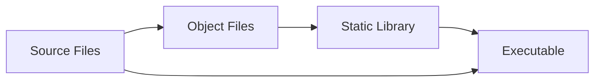

# 📚 Object Files and Static Libraries Guide (.o & .a)

> A comprehensive guide to understanding and working with object files and static libraries in C/C++ development

---

## 🎯 Table of Contents

- Overview
- Object Files (.o)
- Static Libraries (.a)
- Workflow & Usage
- Practical Example
- Best Practices
- Common Commands

---

## 📖 Overview

This guide provides a comprehensive overview of object files (.o) and static libraries (.a) — essential components in C/C++ development that enable modular, efficient, and reusable code organization.

### 🎯 What You'll Learn

- Understanding the compilation process
- Working with object files and static libraries
- Building modular and maintainable projects
- Optimizing build times and code reuse

---

## 🔧 Object Files (.o)

Object files are intermediate compilation outputs that contain machine code but are not yet executable programs.

### ✨ Key Characteristics

| Feature | Description |
|---------|-------------|
| Non-executable | Cannot run independently — requires linking |
| Symbol Table | Contains function/variable definitions and external references |
| Modular | Enables incremental compilation for faster builds |
| Platform-specific | Contains machine code for target architecture |

### 🔍 What's Inside?

```
┌─────────────────┐
│   Object File   │
├─────────────────┤
│ Machine Code    │
│ Symbol Table    │
│ Relocation Info │
│ Debug Info      │
└─────────────────┘
```

---

## 📦 Static Libraries (.a)

Static libraries are archives containing one or more object files, created using the ar utility.

### ✨ Key Characteristics

| Feature | Description |
|---------|-------------|
| Archive Format | Collection of object files (like a ZIP for .o files) |
| Static Linking | Code is embedded directly into final executable |
| No Dependencies | Final program has no external library requirements |
| Larger Size | Increases executable size due to code duplication |

### 🔍 Library Structure

```
┌─────────────────┐
│ Static Library  │
├─────────────────┤
│ Object File 1   │
│ Object File 2   │
│ Object File 3   │
│ Symbol Index    │
└─────────────────┘
```

---

## ⚙️ Workflow & Usage

### 🔄 Development Process



### 📋 Step-by-Step Workflow

1. Compilation → Source files to object files
2. Archiving → Object files to static library
3. Linking → Library + main program to executable

---

## 💻 Practical Example

Let's build a simple math library to demonstrate the complete workflow.

### 📁 Project Structure

```
math_project/
├── math_functions.h
├── math_functions.c
├── main.c
└── Makefile
```

### 🔧 Header File

```c
// math_functions.h
#ifndef MATH_FUNCTIONS_H
#define MATH_FUNCTIONS_H

// Function declarations
int add(int a, int b);
int subtract(int a, int b);
int multiply(int a, int b);
double divide(double a, double b);

#endif
```

### 🔧 Implementation

```c
// math_functions.c
#include "math_functions.h"

int add(int a, int b) {
    return a + b;
}

int subtract(int a, int b) {
    return a - b;
}

int multiply(int a, int b) {
    return a * b;
}

double divide(double a, double b) {
    if (b != 0) {
        return a / b;
    }
    return 0.0; // Error case
}
```

### 🔧 Main Program

```c
// main.c
#include <stdio.h>
#include "math_functions.h"

int main() {
    int a = 10, b = 5;
    
    printf("🔢 Math Operations Demo\n");
    printf("======================\n");
    printf("a = %d, b = %d\n\n", a, b);
    
    printf("➕ Addition: %d + %d = %d\n", a, b, add(a, b));
    printf("➖ Subtraction: %d - %d = %d\n", a, b, subtract(a, b));
    printf("✖️  Multiplication: %d * %d = %d\n", a, b, multiply(a, b));
    printf("➗ Division: %.1f / %.1f = %.2f\n", (double)a, (double)b, divide(a, b));
    
    return 0;
}
```

### 🛠️ Build Process

#### Step 1: Compile to Object Files

```bash
# Compile source files to object files
gcc -c math_functions.c -o math_functions.o
gcc -c main.c -o main.o
```

#### Step 2: Create Static Library

```bash
# Create static library from object files
ar rcs libmath.a math_functions.o
```

#### Step 3: Link and Build Executable

```bash
# Link main program with static library
gcc main.o -L. -lmath -o math_app
```

#### Step 4: Run the Program

```bash
# Execute the program
./math_app
```

### 📊 Expected Output

```
🔢 Math Operations Demo
======================
a = 10, b = 5

➕ Addition: 10 + 5 = 15
➖ Subtraction: 10 - 5 = 5
✖️  Multiplication: 10 * 5 = 50
➗ Division: 10.0 / 5.0 = 2.00
```

---

## 🎯 Best Practices

### ✅ Do's

- Use meaningful names for libraries and functions
- Include proper headers with include guards
- Document your functions with clear comments
- Test thoroughly before creating libraries
- Use version control for library management

### ❌ Don'ts

- Don't forget include guards in header files
- Don't mix C and C++ in the same library
- Don't ignore error handling in library functions
- Don't create overly large monolithic libraries

### 🔧 Makefile Example

```makefile
# Compiler and flags
CC = gcc
CFLAGS = -Wall -Wextra -std=c99
AR = ar
ARFLAGS = rcs

# Files
LIB_NAME = libmath.a
OBJ_FILES = math_functions.o
HEADER_FILES = math_functions.h

# Targets
all: $(LIB_NAME) math_app

$(LIB_NAME): $(OBJ_FILES)
	$(AR) $(ARFLAGS) $@ $^

%.o: %.c $(HEADER_FILES)
	$(CC) $(CFLAGS) -c $< -o $@

math_app: main.o $(LIB_NAME)
	$(CC) main.o -L. -lmath -o $@

clean:
	rm -f *.o *.a math_app

.PHONY: all clean
```

---

## 🛠️ Common Commands

### 📋 Object File Commands

| Command | Description |
|---------|-------------|
| `gcc -c file.c -o file.o` | Compile to object file |
| `nm file.o` | List symbols in object file |
| `objdump -t file.o` | Display symbol table |
| `file file.o` | Show file type information |

### 📦 Library Commands

| Command | Description |
|---------|-------------|
| `ar rcs libname.a file1.o file2.o` | Create static library |
| `ar t libname.a` | List contents of library |
| `ar x libname.a` | Extract object files |
| `nm libname.a` | List symbols in library |

### 🔗 Linking Commands

| Command | Description |
|---------|-------------|
| `gcc main.c -L. -lname -o program` | Link with library |
| `gcc main.c -static -L. -lname -o program` | Static linking |
| `ldd program` | Show library dependencies |

---

## 📚 Additional Resources

- GNU Make Manual — https://www.gnu.org/software/make/manual/
- GCC Documentation — https://gcc.gnu.org/onlinedocs/
- Static vs Dynamic Libraries — https://www.geeksforgeeks.org/static-vs-dynamic-libraries/

---

**Happy Coding! 🚀**

# 📚 Object Files (.o) and Static Libraries (.a)

> A clear, high-level guide to what they are, why they exist, and how they fit together in C/C++ build systems. Includes concise ELF, linking, symbols, and relocations — just enough to build a strong mental model.

---

## 🧭 Table of Contents

1. Key Concepts at a Glance
2. Object Files (.o)
3. Static Libraries (.a)
4. ELF Essentials (just enough)
5. Linking: From Objects to Executables
6. Symbols and Resolution
7. Relocations
8. Putting It Together: Mental Model
9. Useful Tools (optional)
10. Troubleshooting Quick Reference

---

## 1) 🔎 Key Concepts at a Glance

- **Object file (.o)**: compiled machine code for a single translation unit, plus metadata (symbols, relocations, sections).
- **Static library (.a)**: archive of many `.o` files with a fast symbol index; the linker extracts only what’s needed.
- **ELF**: the standard format for object files/executables on Unix-like systems; you only need a few concepts to be effective.
- **Linking**: the process that resolves symbols and applies relocations, producing an executable or shared object.

---

## 2) 🧩 Object Files (.o)

### What is an object file?
An object file is the output of compiling a single source file (`.c`/`.cpp`) without linking. It contains machine code plus metadata needed for later stages.

### Why object files?
- Enable incremental builds: only changed sources recompile
- Support modular design: separate compilation per translation unit
- Provide metadata: symbols, relocations, and section layout for the linker

### How object files are used
- They are inputs to the linker. The linker combines multiple `.o` files (and optionally libraries) into an executable or a shared library.

---

## 3) 🗂️ Static Libraries (.a)

### What is a static library?
A static library is an archive (`.a`) of many object files. Think of it as a container bundling `.o` files along with a symbol index to make lookup fast.

### Why static libraries?
- Reuse: package related functionality behind a stable API
- Faster links: one library instead of many separate `.o` paths
- Distribution: share compiled code without exposing sources

### How static libraries are used
- During linking, the linker scans the library and extracts only the object files required to resolve currently undefined symbols in the link.
- Linking order matters: libraries should appear after the objects that reference them.

---

## 4) 🧱 ELF Essentials (just enough)

Most Unix-like systems use ELF (Executable and Linkable Format). You rarely need all details; these are the parts that matter for `.o` and `.a`:

### Sections you will see
- `.text`: machine code for functions
- `.rodata`: read-only data (string literals, constants)
- `.data`: initialized writable globals
- `.bss`: zero-initialized globals (occupies no space on disk)
- `.symtab` + `.strtab`: symbols and their names (for the linker/tools)
- `.rel.*` / `.rela.*`: relocation entries describing how to fix up addresses

### Files and headers
- Relocatable object (`.o`): has an ELF header and a section header table (no program headers because it’s not runnable)
- Static library (`.a`): is not ELF itself; it’s an ar-archive containing multiple ELF `.o` members plus a symbol index
- Executable/shared object: adds program headers that guide the loader at runtime (not present in `.o`)

---

## 5) 🔗 Linking: From Objects to Executables

### The linker’s job
- Combine sections from multiple `.o` files
- Resolve undefined symbols (find their definitions)
- Apply relocations (fix addresses)
- Produce a final image (executable or shared object)

### Library participation
- When the linker encounters an undefined symbol, it searches libraries listed on the command line (in order). If a library contains an object file that defines the symbol, that object file is pulled in and its references are processed.
- Only needed members of a static library are extracted, keeping the final output lean.

### Order matters
- Place dependent objects first, then libraries that satisfy them. Example pattern: `gcc obj1.o obj2.o -L<path> -l<name> -o app`.

---

## 6) 🏷️ Symbols and Resolution

### Symbol basics
- A symbol is a named entity (typically a function or global) appearing in the symbol table
- Binding types include `LOCAL`, `GLOBAL`, and `WEAK`
- Undefined symbols (section `UND`) must be resolved from other objects or libraries during the link

### Common symbol categories
- Function symbols (`FUNC`) — implementations in `.text`
- Object symbols (`OBJECT`) — data in `.data`/`.bss`
- Undefined symbols — declared/used but not defined in the current object

### Practical implications
- Mismatched declarations cause link errors or undefined behavior
- Multiple strong definitions of the same symbol cause “multiple definition” errors
- Weak symbols act as fallbacks if a strong definition is not provided

---

## 7) 📍 Relocations

### What is relocation?
Object files cannot know final addresses at compile time. Relocation entries record “fixups” that the linker must apply when it lays out sections in memory.

### Typical relocation flow
- A call from one function to another is recorded with a relocation entry pointing to the target symbol
- During linking, once symbol addresses are known, the linker writes the correct value into the patched location (absolute or PC-relative, depending on the platform/relocation type)

### REL vs RELA (conceptual)
- `REL`: the addend is stored at the relocation target location
- `RELA`: the addend is stored in the relocation entry itself

You generally don’t need to choose; your toolchain emits what your platform uses.

---

## 8) 🧠 Putting It Together: Mental Model

1) Compile each source file → `.o` (ELF relocatable object with sections, symbols, relocations)  
2) Optionally pack related `.o` into `.a` (static library with a symbol index)  
3) Link objects and libraries → final executable/shared object (symbols resolved, relocations applied)

This modular flow enables fast builds, code reuse, and clean separation of concerns.

---

## 9) 🛠️ Useful Tools (optional)

- Show symbols: `nm file.o` (look for T/t for text, U for undefined)
- Show sections: `readelf -S file.o`
- Show relocations: `readelf -r file.o`
- Inspect library members: `ar t libsomething.a`

---

## 10) 🚑 Troubleshooting Quick Reference

| Problem | Likely Cause | Fix |
|--------|---------------|-----|
| `undefined reference to 'foo'` | Missing definition or library order | Place library after objects; ensure symbol exists |
| `cannot find -l<name>` | Library not found in search paths | Add `-L<dir>` or correct library name |
| Multiple definition of `foo` | Same strong symbol defined twice | Keep a single definition or use internal (static) linkage |
| Wrong or stale behavior | Old objects/libraries used | Clean and rebuild (`rm *.o *.a`), then link again |

---

This guide intentionally focuses on essentials: what `.o` and `.a` are, how they fit with ELF, and how linkers resolve symbols and apply relocations. The sections are designed to read as one cohesive story from compile to link.
